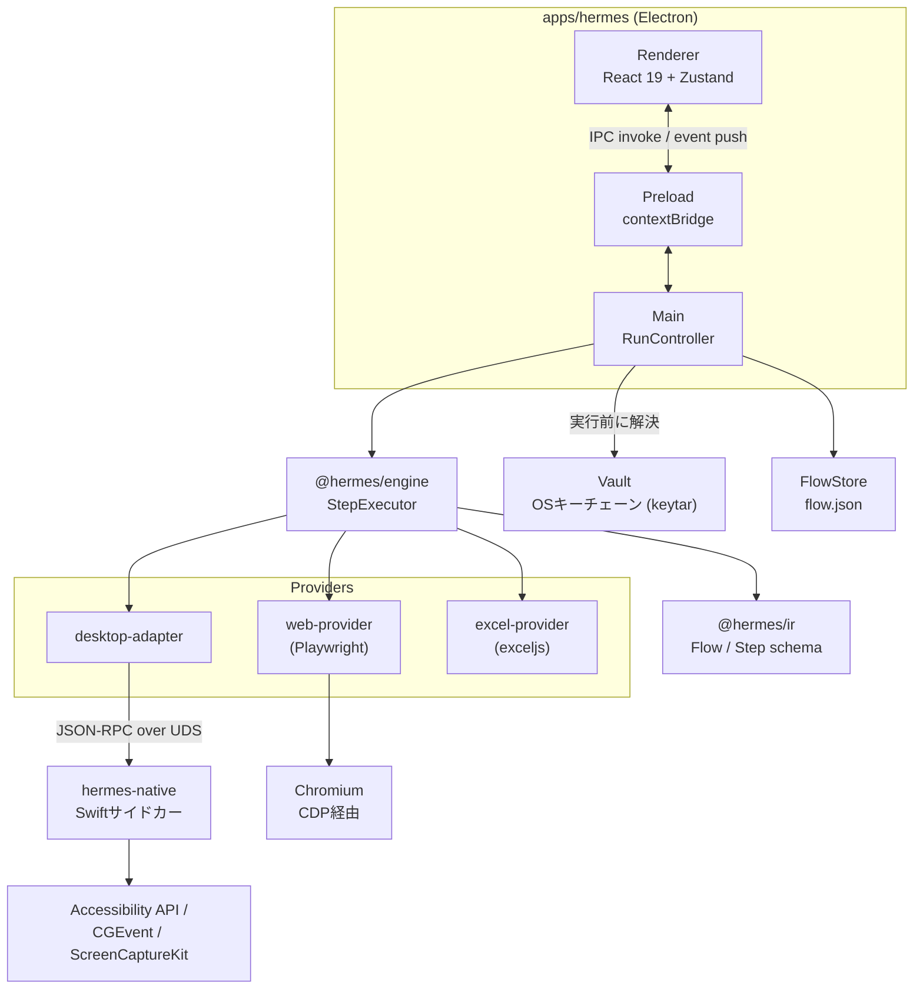

# Hermes

決定論的な記録/編集/再生に、AI判定レイヤーとAI生成レイヤーを重ねた3-in-1のRPAデスクトップアプリ。原則は一貫して「**AIは操作しない**」。

[English](README.md) | [日本語](README.ja.md) | [中文](README.zh.md)


> **現状: pre-alpha。** Hermesはまだ実用段階ではありません。何が動いていて何が動いていないかは下記の[Status](#status)を参照してください。構築の過程を最初から追えるよう、リポジトリは公開初日からpublicにしています。

## Why(なぜ作ったか)

RPAツールはたいてい二択を迫ってくる。純粋に決定論的なレコーダーは正確で再現性もあるが脆い――UI要素が数ピクセルずれる、ページにローディングスピナーが追加される、それだけでフロー全体が壊れる。完全にAI主導の「エージェント」はそうしたズレに強い代わりに、RPAを信頼できるものにしていたはずのものを手放してしまう。フローが2回とも同じ動作をすると証明できなくなり、実機のマウス・キーボードをモデルに直接操作させることは、自動化として本質的にリスクが高い。

Hermesはこの二択を迫られないようにしようとしている。フローが実際に行うすべての操作――ここをクリック、これを入力、あれを待つ――は同一の決定論的エンジンを通るので、フローはビット単位で再現可能で、ステップごとに監査できる。AIはこの土台の上に、AIが本当に得意な2つのことのためだけに重ねる: 画面が正しいかを**判定する**こと(アサーション――yes/no/extractのみで、決して操作しない)、そして事前定義された決定論的なステップの固定ライブラリからフローを**組み立てる**こと。モデルが決められるのは「次にどのステップを使うか」だけで、操作を発明することも、自ら操作を実行することも一切できない。

## Design at a glance(設計の全体像)

Hermesは同じ決定論的な土台の上に、3つのモードでUI自動化を実行する。

| モード | 実行されるもの | AIの役割 |
|---|---|---|
| 1. RPA | 記録されたアクション、決定論的 | なし |
| 2. RPA + AI判定 | 決定論的なアクション、AIによるアサーション | yes/no/抽出のみ――操作は決してしない |
| 3. AI生成 | 同じ決定論的エンジン、AIが生成するIR | 固定のStep Libraryを組み合わせるだけ。コードは書けない |

**原則: AIは操作しない。** Mode 2では、モデルは現在の画面状態についてyes/no/抽出の質問に答えるだけで、その判定に基づいて自らクリックしたり入力したりすることはできない。Mode 3では、モデルは事前定義されたステップ型の閉じた集合(Step Library、`AllowList`でさらに絞り込み)からフローを組み立てるだけで、任意のコードやエンジンに存在しないステップ型を生成することはできない。どのモードで作られたフローであっても、まったく同じ決定論的な`StepExecutor`が再生するため、AIが作ったフローは手動で記録したフローと全く同じように監査可能・再現可能である。

## Features(主要機能)

- **記録→編集→再生、決定論的に。** 記録(Webは注入スクリプト経由、デスクトップはSwiftサイドカーのグローバルイベントタップ経由)はIR(中間表現)のフローを生成し、構造化されたエグゼキュータがステップごとに再生する――同じフローは毎回同じように動く。
- **ブラックボックスではない、型付き・検証済みのIR。** フローはJSON Schema(ajv)で検証される素のJSONで、明示的な`CURRENT_SCHEMA_VERSION`と旧フロー用のマイグレーション経路を持つ。26種類のステップ型、11種類のセレクタ、9種類の待機条件が`packages/ir`で定義され、全レイヤーで共有される。
- **秘密情報がフローファイルに触れることはない。** フローは秘密情報を`${secrets.<name>}`という参照でしか持てず、実際の値はOSキーチェーン(`keytar`経由)に置かれ、実行開始直前にアプリが解決する。実行エンジン自体はVaultに一切アクセスしない。
- **クロスプラットフォームな設計、今日動くのは実際のネイティブ実行。** `desktop-adapter`がOS非依存の契約を定義し、macOS実装はAccessibility API・CGEvent・ScreenCaptureKitを、別プロセスのSwift(`hermes-native`)経由でUnixドメインソケット上のJSON-RPCとして駆動する――ネイティブ自動化が安全性の低いプロセス内ブリッジを必要とせず、同じ契約の裏にWindows実装を後から差し込める設計になっている。
- **Excelインストール不要のファイルベースExcelプロバイダ。** `excel-provider`は`exceljs`経由で`.xlsx`を直接読み書きするため、フロー内のスプレッドシート操作はMicrosoft ExcelやWindowsのキー送出トリックなしに、macOS上でテスト・実行できる。
- **GUIだけでなくヘッドレス実行も。** `@hermes/cli`(`hermes run <flow.json>`)はElectronを起動せずに同じエンジンとプロバイダでフローを再生する。スクリプトやCI用途向け。

## Architecture(構成)



責務ごとに3層に分かれている:

1. **TypeScriptコア**(`packages/*`)— IRスキーマ、決定論的な実行エンジン、各面向けプロバイダ(Web・デスクトップ・Excel)。OS非依存。
2. **Electronアプリ**(`apps/hermes`)— Main/Preload/Rendererの3プロセス。全オーケストレーション、Zustandベースのウィジェット、実行のためにプロバイダを束ねる唯一の`RunController`を持つ。
3. **ネイティブサイドカー**(`sidecars/macos-native`)— 別プロセスのSwift(`hermes-native`)がUnixドメインソケット上でJSON-RPCを話す。これにより Accessibility/CGEvent/ScreenCaptureKit の呼び出しがNode/Electronプロセスから分離される。同じ`desktop-adapter`契約の裏に立つWindows版サイドカーは今後の課題。

秘密情報は一つの経路しか通らない: `Vault`経由でOSキーチェーンに保存され、実行開始直前に`RunController`が解決し、すでに解決済みの値としてエンジンに注入される――エンジンとフローJSONは`${secrets.<name>}`という参照以外を一切見ることがない。

## Tech Stack(技術スタック)

**コア**: TypeScript 5.7, pnpm workspace monorepo, Zod(RPC/IPC契約), Ajv(IR検証), Vitest
**アプリ**: Electron, React 19, Zustand, electron-vite, electron-builder
**自動化**: Web用Playwright(`playwright-core`)、Excel用`exceljs`、メタデータ用`better-sqlite3`、OSキーチェーン用`keytar`
**ネイティブサイドカー**: Swift(Accessibility API, CGEvent, ScreenCaptureKit)、Unixドメインソケット上のJSON-RPC 2.0
**AI(計画中・未配線)**: OpenRouterクライアントと、制約付きフロー生成用のStep Library / AllowList

## Getting Started(セットアップ)

### 前提条件

- macOS 13 Ventura以降(ScreenCaptureKitとプロセス単位のプライバシーAPIのため)
- [Node.js 22](https://nodejs.org/)(`.nvmrc`で固定。**Node 22であること**が重要――より新しい既定バージョンだと`better-sqlite3`のネイティブビルドが壊れる)
- [pnpm 11+](https://pnpm.io/installation): `npm install -g pnpm`
- Xcode Command Line Tools: `xcode-select --install`(Swiftサイドカー用)

### セットアップ手順

```bash
git clone https://github.com/Tomato-1101/Hermes.git
cd Hermes
export PATH="/opt/homebrew/opt/node@22/bin:$PATH"   # Node 22をPATHに通す
pnpm install
pnpm sidecar:mac:build      # sidecars/macos-native (Swift) をビルド
pnpm dev                    # Electronアプリをdevモードで起動
```

ローカルの未署名`.app`を作る場合:

```bash
pnpm build:mac
open apps/hermes/dist/mac-arm64/Hermes.app
```

Mode 1(決定論的RPA)のビルド・実行にAPIキーは不要――現時点のコードベースは外部AIプロバイダをまだ一切呼び出していない。

> **なぜ署名済みビルドを配布しないか?** Hermesはソースとして配布される。各ユーザーがローカルでビルドし、署名/公証済みのバイナリは配布しない方針で、pre-alphaの間はApple Developer Programと公証パイプラインの負担から自由でいられる。

### macOSのプライバシー権限

| 権限 | 理由 |
|---|---|
| アクセシビリティ | AXUIElement経由でUI要素を読み取り・クリックする |
| 画面収録 | ScreenCaptureKit経由でスクリーンショット/ピクセルマッチングを行う |
| 入力監視 | レコーダーがグローバルなキー・マウスイベントを記録する |

初回起動時、Hermesは権限状態を表示し、システム設定 → プライバシーとセキュリティへの「設定を開く」ディープリンクを提供する。

## Project Structure(主要ディレクトリ)

```
apps/hermes               Electronアプリ(Main + Preload + Renderer)
packages/ir                フローIR: 型・JSON Schema・検証・式言語
packages/engine             決定論的なステップエグゼキュータ
packages/desktop-adapter     OS非依存の契約 + macOS実装 + サイドカーRPCクライアント
packages/web-provider         Playwrightベースのweb自動化プロバイダ
packages/recorder-web          Web操作レコーダー(注入スクリプト + exposeBinding)
packages/excel-provider          ファイルベースの.xlsxプロバイダ(exceljs)
packages/storage                  SQLiteメタデータ・フローのファイル配置・キーチェーンVault
packages/cli                       ヘッドレスなフローランナー(`hermes run <flow.json>`)
packages/ai                         OpenRouterクライアント + Step Library + AllowList(スタブ・未配線)
packages/ui-kit                      共有UIコンポーネント(未実装)
sidecars/macos-native      SwiftサイドカーAX / CGEvent / ScreenCaptureKit(JSON-RPC/UDS経由)
sidecars/python-vision      将来の画面認識サイドカー(未実装)
docs/ai-spec               コードベース全体の生きた設計リファレンス(まずここから読む)
docs/PLAN.md                プロジェクト全体計画とフェーズ分割
```

## Testing(テスト)

```bash
pnpm test          # 全ワークスペースでvitest(ウォッチモード)
pnpm test:run       # 同上、単発実行――8パッケージにまたがる23テストファイル
pnpm lint          # 全ワークスペースでeslint
pnpm typecheck     # 全ワークスペースでtsc --noEmit
```

CIは2つのGitHub Actionsワークフローを回す: `ci.yml`(`main`へのpush/PRごと、`macos-14`上で各パッケージを`tsc -b`でビルド→lint→typecheck→`test:run`、加えてSwiftサイドカーをビルドしUnixドメインソケット経由でpingする別ジョブ)と、`build-mac.yml`(手動dispatch: 未署名`.app`をエンドツーエンドでビルド)。Electronのrendererにはまだ自動テストが無く、tsc + build + 目視確認で検証している。

## Status(完成度)

**Pre-alpha。** まだ製品として使える段階ではない。本稿執筆時点で具体的には:

- **実装済みなのはMode 1(決定論的RPA)のみ**: Web(Playwright経由)とmacOSネイティブアプリ(Swiftサイドカー経由)の記録・再生、およびファイルベースのExcelプロバイダが動作する。今日実際に使えるのはこのモードだけ。
- **Mode 2(AI判定)とMode 3(AI生成)は設計のみで未実装。** `@hermes/ai`パッケージ(OpenRouterクライアント・Step Libraryスキーマ・AllowList)は存在するが、稼働中のアプリのどこからもimport・呼び出しされていない――まだ着手されていない作業のためのスタブ。
- `@hermes/cli`は独立したヘッドレスランナーとしては動作するが、デスクトップアプリには配線されていない。
- `packages/ui-kit`と`sidecars/python-vision`は実装の無いプレースホルダディレクトリ。
- Windows対応は存在しない。`desktop-adapter`契約は将来対応できるよう設計されているが、今日実装があるのはmacOS版のみ。
- 署名済み・公証済みビルドは配布していない――ソースからのビルドのみ。

## License(ライセンス)

MIT — [LICENSE](LICENSE) を参照。
