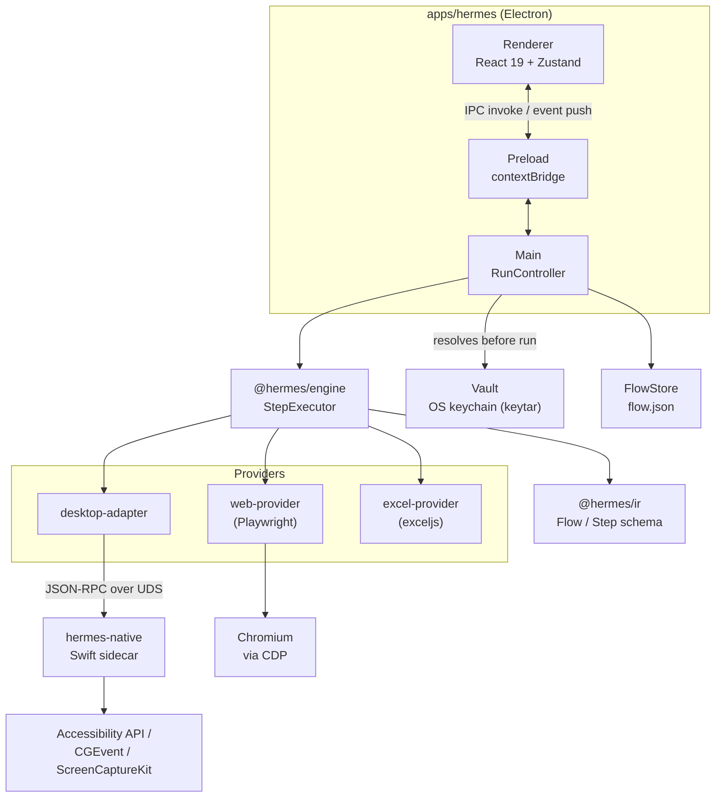

# Hermes

A 3-in-1 RPA desktop app — deterministic record/edit/replay, with an AI judgment layer and an AI generation layer stacked on top, built on the rule that **AI never operates**.

[English](README.md) | [日本語](README.ja.md) | [中文](README.zh.md)


> **Status: pre-alpha.** Hermes is not ready for real use yet. See [Status](#status) below for exactly what does and doesn't work today. The repository is public from day one so the design and source are inspectable as it's built.

## Why

RPA tools tend to force a choice between two bad options. Purely deterministic recorders are precise and replayable, but brittle — a UI element moves a few pixels or a page adds a loading spinner, and the whole flow breaks. Fully AI-driven "agents" are more resilient to that kind of drift, but they trade away the thing that made RPA trustworthy in the first place: you can no longer prove a flow will do the same thing twice, and letting a model directly drive mouse and keyboard on a real machine is a genuinely risky thing to automate.

Hermes tries not to have to choose. Every action a flow actually performs — click here, type this, wait for that — runs through the same deterministic engine, so a flow can be replayed bit-for-bit and audited step by step. AI is layered on top of that foundation for the two things it's actually good at: **judging** whether the screen looks right (an assertion — yes/no/extract, never an action) and **composing** a flow out of a fixed library of pre-defined, deterministic steps. The model can decide *what* step to use next; it can never invent an operation or execute one directly.

## Design at a glance

Hermes runs UI automation in three modes, layered on the same deterministic foundation:

| Mode | What runs | AI's role |
|---|---|---|
| 1. RPA | Recorded actions, deterministic | none |
| 2. RPA + AI judgment | Deterministic actions, AI assertions | yes/no/extract only — never operates |
| 3. AI generation | Same deterministic engine, IR produced by AI | composes a fixed Step Library; cannot write code |

**The cardinal rule: AI never operates.** In Mode 2, the model can only answer a yes/no/extract question about the current screen state — it cannot click, type, or otherwise act on that judgment itself. In Mode 3, the model can only assemble a flow from a closed set of pre-defined step types (the Step Library, filtered through an `AllowList`) — it cannot generate arbitrary code or a step type that doesn't already exist in the engine. Whatever mode produced a flow, the exact same deterministic `StepExecutor` replays it, so a flow authored by AI is exactly as auditable and repeatable as one recorded by hand.

## Features

- **Record → edit → replay, deterministically.** Recording (web via an injected script, desktop via the Swift sidecar's global event tap) produces an IR (intermediate representation) flow that a structured executor replays step by step — the same flow runs the same way every time.
- **A typed, validated IR, not a black box.** Flows are plain JSON validated against a JSON Schema (ajv), with an explicit `CURRENT_SCHEMA_VERSION` and migration path for older flows. 26 step types, 11 selector kinds, and 9 wait conditions are defined in `packages/ir`, shared by every layer.
- **Secrets never touch the flow file.** A flow can only reference a secret as `${secrets.<name>}`; the actual value lives in the OS keychain (via `keytar`) and is resolved by the app just before a run starts. The execution engine itself never has access to the Vault.
- **Cross-platform surface, real native execution today.** `desktop-adapter` defines an OS-independent contract; the macOS implementation drives the Accessibility API, CGEvent, and ScreenCaptureKit through a separate Swift process (`hermes-native`) over JSON-RPC on a Unix domain socket — so native automation doesn't require an unsafe in-process bridge, and a Windows implementation can be dropped in behind the same contract later.
- **A file-based Excel provider that needs no Excel install.** `excel-provider` reads and writes `.xlsx` directly via `exceljs`, so spreadsheet steps in a flow are testable and runnable on macOS without Microsoft Excel or Windows key-injection tricks.
- **Headless execution, not just a GUI.** `@hermes/cli` (`hermes run <flow.json>`) replays a flow through the same engine and providers without launching Electron, for scripting or CI use.

## Architecture



Three layers, split by what they need to know:

1. **TypeScript core** (`packages/*`) — the IR schema, the deterministic execution engine, and the per-surface providers (web, desktop, Excel). OS-independent.
2. **Electron app** (`apps/hermes`) — Main/Preload/Renderer processes; owns all orchestration, the Zustand-backed UI, and the one `RunController` that wires providers together for a run.
3. **Native sidecar** (`sidecars/macos-native`) — a separate Swift process (`hermes-native`) that talks JSON-RPC over a Unix domain socket, so Accessibility/CGEvent/ScreenCaptureKit calls stay isolated from the Node/Electron process. A Windows sidecar behind the same `desktop-adapter` contract is future work.

Secrets follow one path only: stored in the OS keychain via the `Vault`, resolved by `RunController` right before a run starts, and injected into the engine as already-resolved values — the engine and the flow JSON never see anything but a `${secrets.<name>}` reference.

## Tech Stack

**Core**: TypeScript 5.7, pnpm workspace monorepo, Zod (RPC/IPC contracts), Ajv (IR validation), Vitest
**App**: Electron, React 19, Zustand, electron-vite, electron-builder
**Automation**: Playwright (`playwright-core`) for web, `exceljs` for Excel, `better-sqlite3` for metadata, `keytar` for the OS keychain
**Native sidecar**: Swift (Accessibility API, CGEvent, ScreenCaptureKit) over JSON-RPC 2.0 on a Unix domain socket
**AI (planned, not yet wired in)**: OpenRouter client and a Step Library / AllowList for constrained flow generation

## Getting Started

### Prerequisites

- macOS 13 Ventura or newer (ScreenCaptureKit and per-process privacy APIs)
- [Node.js 22](https://nodejs.org/) (`.nvmrc` pins this; **Node 22 specifically** — the newer default breaks `better-sqlite3`'s native build)
- [pnpm 11+](https://pnpm.io/installation): `npm install -g pnpm`
- Xcode Command Line Tools: `xcode-select --install` (for the Swift sidecar)

### Setup

```bash
git clone https://github.com/Tomato-1101/Hermes.git
cd Hermes
export PATH="/opt/homebrew/opt/node@22/bin:$PATH"   # ensure Node 22 is on PATH
pnpm install
pnpm sidecar:mac:build      # builds sidecars/macos-native (Swift)
pnpm dev                    # launches the Electron app in dev mode
```

To produce a local, unsigned `.app`:

```bash
pnpm build:mac
open apps/hermes/dist/mac-arm64/Hermes.app
```

No API keys are required to build or run Mode 1 (deterministic RPA) — nothing in the current codebase calls out to an external AI provider yet.

> **Why no signed build?** Hermes is distributed as source. Each user builds locally; no signed/notarized binaries are shipped, which keeps the project free of the Apple Developer Program and the notarization pipeline while it's still pre-alpha.

### macOS privacy permissions

| Permission | Why |
|---|---|
| Accessibility | Read and click UI elements via AXUIElement |
| Screen Recording | Capture screenshots / pixel matching via ScreenCaptureKit |
| Input Monitoring | Record global key + mouse events for the recorder |

On first launch, Hermes shows permission status with "Open Settings" deep-links to System Settings → Privacy & Security.

## Project Structure

```
apps/hermes               Electron app (Main + Preload + Renderer)
packages/ir                Flow IR: types, JSON Schema, validation, expression language
packages/engine             Deterministic step executor
packages/desktop-adapter     OS-independent contract + macOS implementation + sidecar RPC client
packages/web-provider         Playwright-backed web automation provider
packages/recorder-web          Web action recorder (injected script + exposeBinding)
packages/excel-provider          File-based .xlsx provider (exceljs)
packages/storage                  SQLite metadata, flow filesystem layout, keychain Vault
packages/cli                       Headless flow runner (`hermes run <flow.json>`)
packages/ai                         OpenRouter client + Step Library + AllowList (stub, not wired in yet)
packages/ui-kit                      Shared UI components (not yet implemented)
sidecars/macos-native      Swift sidecar: AX / CGEvent / ScreenCaptureKit over JSON-RPC/UDS
sidecars/python-vision      Future screen-vision sidecar (not yet implemented)
docs/ai-spec               Living design reference for the whole codebase (start here)
docs/PLAN.md                Overall project plan and phase breakdown
```

## Testing

```bash
pnpm test          # vitest across all workspaces (watch mode)
pnpm test:run       # same, single run — 23 test files across 8 packages
pnpm lint          # eslint over all workspaces
pnpm typecheck     # tsc --noEmit over all workspaces
```

CI runs two GitHub Actions workflows: `ci.yml` (on every push/PR to `main`, on `macos-14`: build each package with `tsc -b`, then lint, typecheck, and `test:run`, plus a separate job that builds the Swift sidecar and pings it over its Unix domain socket) and `build-mac.yml` (manual dispatch: builds an unsigned `.app` end-to-end). The Electron renderer has no automated tests yet — it's verified by `tsc` + build + manual inspection.

## Status

**Pre-alpha.** Not usable as a product yet. Concretely, as of this writing:

- **Mode 1 (deterministic RPA) is what's implemented**: record and replay work for web (via Playwright) and for native macOS apps (via the Swift sidecar), plus a file-based Excel provider. This is the only mode you can actually use today.
- **Mode 2 (AI judgment) and Mode 3 (AI generation) are designed but not built.** The `@hermes/ai` package exists (an OpenRouter client, a Step Library schema, an AllowList) but is not imported or called anywhere in the running app yet — it's a stub for work that hasn't started.
- `@hermes/cli` works as an independent headless runner but isn't wired into the desktop app.
- `packages/ui-kit` and `sidecars/python-vision` are placeholder directories with no implementation.
- Windows support does not exist; the `desktop-adapter` contract is designed to allow it later, but only the macOS implementation exists today.
- No signed or notarized builds are distributed — build from source only.

## License

MIT — see [LICENSE](LICENSE).
