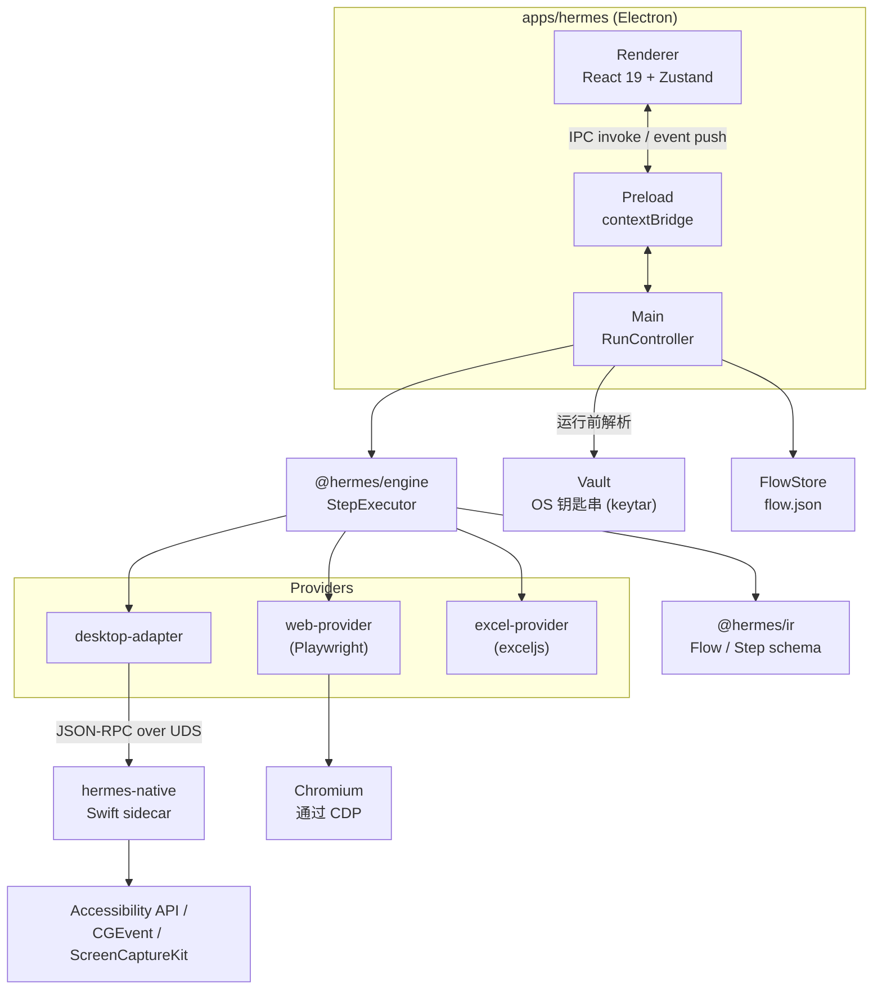

# Hermes

一个 3-in-1 的 RPA 桌面应用——确定性的录制/编辑/回放,之上叠加了 AI 判断层和 AI 生成层,始终遵循一条准则:**AI 从不亲自操作**。

[English](README.md) | [日本語](README.ja.md) | [中文](README.zh.md)


> **当前状态: pre-alpha。** Hermes 目前还不能用于实际工作。具体哪些能用、哪些还不能用,请见下方的 [Status](#status) 部分。项目从第一天起就公开源码,方便在构建过程中随时查看设计与实现。

## Why(为什么做这个)

RPA 工具往往逼你在两个都不太好的选项之间二选一。纯确定性的录制回放工具精确、可复现,但很脆弱——一个界面元素挪了几个像素,或者页面多了个加载动画,整条流程就断了。完全由 AI 驱动的"智能体"对这类漂移更有韧性,但代价是丢掉了 RPA 之所以可信的根本:你再也无法证明同一条流程会两次做出完全相同的事,而让模型直接操控真实电脑的鼠标键盘,本身就是一件相当有风险的自动化方式。

Hermes 试图不必在两者之间做取舍。流程实际执行的每一个动作——点这里、输入这个、等那个——都经过同一个确定性引擎,因此流程可以被逐位复现、逐步审计。AI 只叠加在这套基础之上,专门做它真正擅长的两件事:**判断**屏幕状态是否符合预期(一种断言——仅限 yes/no/提取,绝不亲自操作),以及从一套预先定义好的、固定的确定性步骤库中**组装**流程。模型能决定的只是"接下来用哪个步骤",它既不能凭空发明一个操作,也不能自己去执行操作。

## Design at a glance(设计概览)

Hermes 在同一套确定性基础之上,以三种模式运行 UI 自动化:

| 模式 | 实际执行的内容 | AI 的角色 |
|---|---|---|
| 1. RPA | 录制好的动作,确定性执行 | 无 |
| 2. RPA + AI 判断 | 确定性动作 + AI 断言 | 仅 yes/no/提取——从不亲自操作 |
| 3. AI 生成 | 同一套确定性引擎,IR 由 AI 生成 | 组装固定的 Step Library;不能编写代码 |

**核心准则:AI 从不亲自操作。** 在模式 2 中,模型只能针对当前屏幕状态回答一个 yes/no/提取式的问题——它不能基于这个判断自己去点击、输入或做任何操作。在模式 3 中,模型只能从一套封闭的、预先定义好的步骤类型集合(Step Library,再经 `AllowList` 过滤)中组装流程——它不能生成任意代码,也不能生成引擎中尚不存在的步骤类型。无论流程是由哪种模式产生的,回放时都由完全相同的确定性 `StepExecutor` 执行,因此 AI 编写的流程和手工录制的流程一样可审计、可复现。

## Features(主要功能)

- **确定性的录制 → 编辑 → 回放。** 录制(Web 端通过注入脚本,桌面端通过 Swift sidecar 的全局事件监听)会生成一份 IR(中间表示)流程,由结构化的执行器逐步回放——同一条流程每次的行为都完全一致。
- **有类型、经过校验的 IR,而非黑盒。** 流程是普通 JSON,通过 JSON Schema(ajv)校验,拥有明确的 `CURRENT_SCHEMA_VERSION` 及旧版本流程的迁移路径。`packages/ir` 中定义了 26 种步骤类型、11 种选择器类型和 9 种等待条件,供各层共用。
- **敏感信息永远不会进入流程文件。** 流程中只能以 `${secrets.<name>}` 的形式引用密钥,真实值保存在 OS 钥匙串中(通过 `keytar`),仅在运行开始前由应用解析。执行引擎本身完全无法访问 Vault。
- **跨平台的设计,今天已经能用的是真实的原生执行。** `desktop-adapter` 定义了一套与操作系统无关的契约;macOS 实现通过一个独立的 Swift 进程(`hermes-native`),以 JSON-RPC over Unix domain socket 的方式驱动 Accessibility API、CGEvent 和 ScreenCaptureKit——原生自动化因此不需要在进程内建立不安全的桥接,未来也可以在同一契约之下接入 Windows 实现。
- **基于文件的 Excel provider,无需安装 Excel。** `excel-provider` 通过 `exceljs` 直接读写 `.xlsx` 文件,因此流程中的表格操作步骤在 macOS 上无需 Microsoft Excel 或 Windows 按键注入技巧即可测试和运行。
- **不止 GUI,也支持无头执行。** `@hermes/cli`(`hermes run <flow.json>`)通过同一套引擎和 provider 回放流程,无需启动 Electron,适合脚本化或 CI 场景使用。

## Architecture(架构)



按职责划分为三层:

1. **TypeScript 核心**(`packages/*`)——IR schema、确定性执行引擎,以及各端 provider(web、desktop、Excel)。与操作系统无关。
2. **Electron 应用**(`apps/hermes`)——Main/Preload/Renderer 三个进程,负责全部编排、基于 Zustand 的界面,以及在每次运行时把各 provider 组装到一起的唯一 `RunController`。
3. **原生 sidecar**(`sidecars/macos-native`)——一个独立的 Swift 进程(`hermes-native`),通过 Unix domain socket 上的 JSON-RPC 通信,使 Accessibility/CGEvent/ScreenCaptureKit 的调用与 Node/Electron 进程保持隔离。基于同一 `desktop-adapter` 契约的 Windows sidecar 是未来的工作。

密钥只走一条路径:保存在 OS 钥匙串中,由 `Vault` 管理,在运行开始前由 `RunController` 解析,并以已解析好的值注入引擎——引擎和流程 JSON 本身永远只能看到 `${secrets.<name>}` 这样的引用。

## Tech Stack(技术栈)

**核心**: TypeScript 5.7, pnpm workspace monorepo, Zod(RPC/IPC 契约), Ajv(IR 校验), Vitest
**应用**: Electron, React 19, Zustand, electron-vite, electron-builder
**自动化**: Web 端用 Playwright(`playwright-core`)、Excel 用 `exceljs`、元数据用 `better-sqlite3`、OS 钥匙串用 `keytar`
**原生 sidecar**: Swift(Accessibility API, CGEvent, ScreenCaptureKit),Unix domain socket 上的 JSON-RPC 2.0
**AI(规划中,尚未接入)**: OpenRouter 客户端,以及用于约束流程生成的 Step Library / AllowList

## Getting Started(快速开始)

### 前置条件

- macOS 13 Ventura 或更新版本(需要 ScreenCaptureKit 和按进程授权的隐私 API)
- [Node.js 22](https://nodejs.org/)(`.nvmrc` 已固定版本;**必须是 Node 22**——更新的默认版本会导致 `better-sqlite3` 的原生构建失败)
- [pnpm 11+](https://pnpm.io/installation): `npm install -g pnpm`
- Xcode Command Line Tools: `xcode-select --install`(用于构建 Swift sidecar)

### 安装步骤

```bash
git clone https://github.com/Tomato-1101/Hermes.git
cd Hermes
export PATH="/opt/homebrew/opt/node@22/bin:$PATH"   # 确保 PATH 中是 Node 22
pnpm install
pnpm sidecar:mac:build      # 构建 sidecars/macos-native (Swift)
pnpm dev                    # 以开发模式启动 Electron 应用
```

生成本地未签名的 `.app`:

```bash
pnpm build:mac
open apps/hermes/dist/mac-arm64/Hermes.app
```

构建和运行 Mode 1(确定性 RPA)不需要任何 API 密钥——当前代码库中还没有任何地方真正调用外部 AI 服务。

> **为什么不提供签名构建?** Hermes 以源码形式分发,每个用户自行本地构建,不提供签名/公证的二进制文件。这样在 pre-alpha 阶段就无需承担 Apple 开发者计划和公证流程的负担。

### macOS 隐私权限

| 权限 | 用途 |
|---|---|
| 辅助功能(Accessibility) | 通过 AXUIElement 读取并点击界面元素 |
| 屏幕录制 | 通过 ScreenCaptureKit 截图 / 像素匹配 |
| 输入监控 | 录制器捕获全局键盘和鼠标事件 |

首次启动时,Hermes 会显示权限状态,并提供跳转到"系统设置 → 隐私与安全性"的深层链接。

## Project Structure(项目结构)

```
apps/hermes               Electron 应用(Main + Preload + Renderer)
packages/ir                流程 IR:类型、JSON Schema、校验、表达式语言
packages/engine             确定性的步骤执行器
packages/desktop-adapter     与操作系统无关的契约 + macOS 实现 + sidecar RPC 客户端
packages/web-provider         基于 Playwright 的 web 自动化 provider
packages/recorder-web          Web 操作录制器(注入脚本 + exposeBinding)
packages/excel-provider          基于文件的 .xlsx provider(exceljs)
packages/storage                  SQLite 元数据、流程文件布局、钥匙串 Vault
packages/cli                       无头流程运行器(`hermes run <flow.json>`)
packages/ai                         OpenRouter 客户端 + Step Library + AllowList(存根,尚未接入)
packages/ui-kit                      共享 UI 组件(尚未实现)
sidecars/macos-native      Swift sidecar:AX / CGEvent / ScreenCaptureKit(经 JSON-RPC/UDS)
sidecars/python-vision      未来的屏幕视觉识别 sidecar(尚未实现)
docs/ai-spec               面向整个代码库的活文档设计参考(建议从这里开始读)
docs/PLAN.md                项目整体计划与阶段划分
```

## Testing(测试)

```bash
pnpm test          # 在所有工作区运行 vitest(watch 模式)
pnpm test:run       # 同上,单次运行——8 个包共 23 个测试文件
pnpm lint          # 对所有工作区运行 eslint
pnpm typecheck     # 对所有工作区运行 tsc --noEmit
```

CI 运行两个 GitHub Actions 工作流:`ci.yml`(每次向 `main` push/PR 时触发,运行在 `macos-14` 上:依次用 `tsc -b` 构建各个包,再执行 lint、typecheck、`test:run`,另有一个独立 job 构建 Swift sidecar 并通过 Unix domain socket 向它发送 ping)以及 `build-mac.yml`(仅手动触发:端到端构建一个未签名的 `.app`)。Electron 的 renderer 目前还没有自动化测试,通过 tsc + build + 人工检查来验证。

## Status(完成度)

**Pre-alpha。** 目前还不能作为产品使用。截至本文撰写时,具体情况是:

- **目前已实现的只有 Mode 1(确定性 RPA)**:Web 端(通过 Playwright)和 macOS 原生应用(通过 Swift sidecar)的录制与回放已经可用,还有一个基于文件的 Excel provider。这是今天唯一真正能用的模式。
- **Mode 2(AI 判断)和 Mode 3(AI 生成)只完成了设计,尚未实现。** `@hermes/ai` 包已经存在(包含 OpenRouter 客户端、Step Library schema、AllowList),但目前运行中的应用里没有任何地方 import 或调用它——它只是一份为尚未开始的工作预留的存根。
- `@hermes/cli` 作为独立的无头运行器可以正常工作,但尚未接入桌面应用本体。
- `packages/ui-kit` 和 `sidecars/python-vision` 是没有任何实现的占位目录。
- 目前不支持 Windows;`desktop-adapter` 契约在设计上为未来支持留出了空间,但目前只有 macOS 实现是真实存在的。
- 不提供签名或公证过的构建产物——只能从源码自行构建。

## License(许可证)

MIT — 详见 [LICENSE](LICENSE)。
